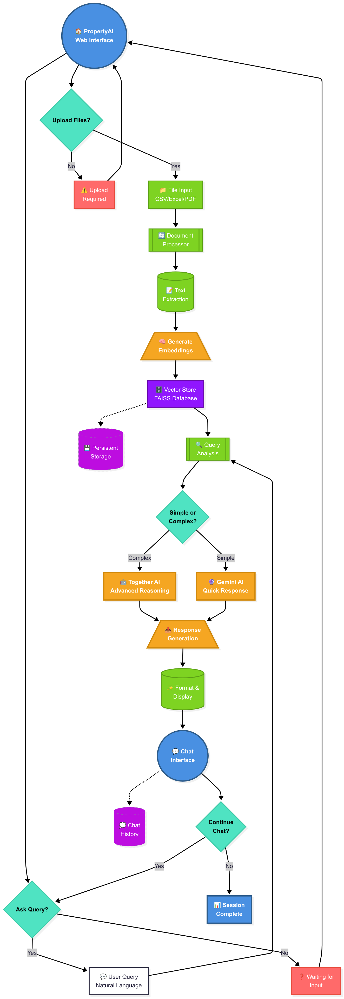
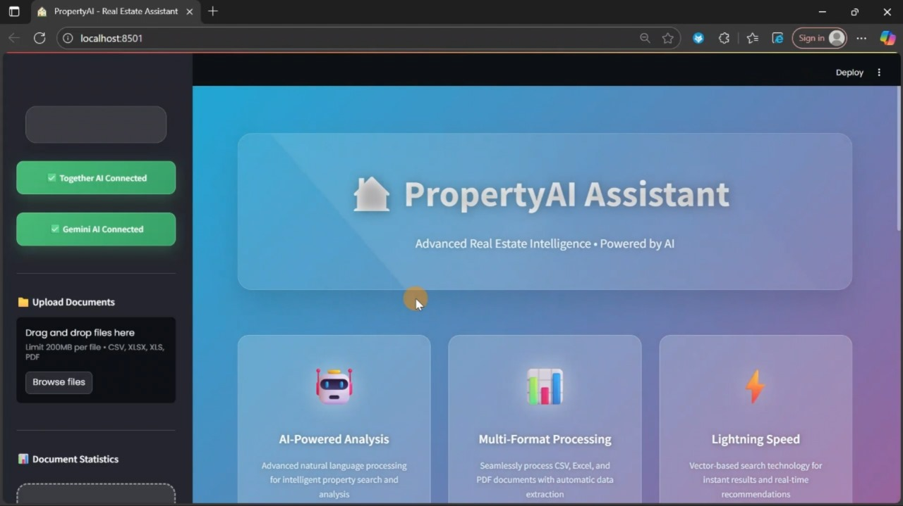
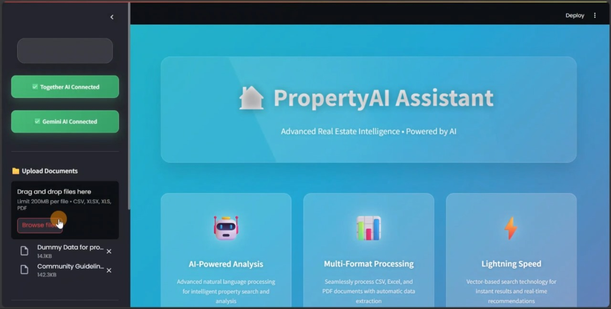
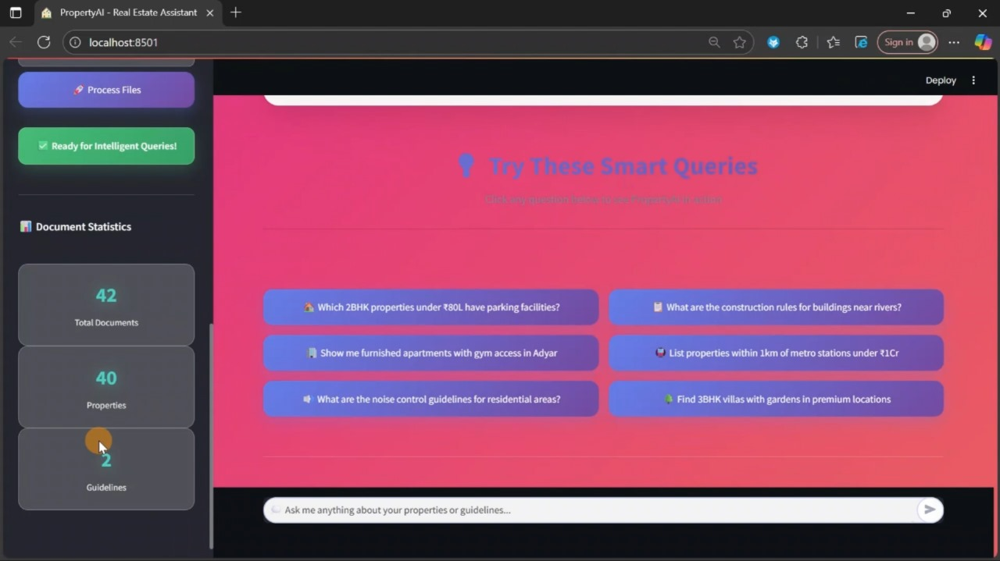
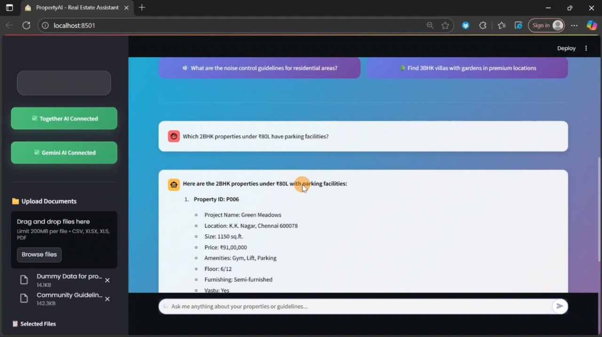

# PropertyAI - Intelligent Real Estate Assistant

**PropertyAI** is an AI-powered assistant that helps users interact with real estate data using natural language. It supports multi-format document ingestion, efficient vector-based search, and intelligent answer generation using Retrieval-Augmented Generation (RAG) with modern language models.

This project is designed for organizations or individuals dealing with property listings, guidelines, and legal documentation, aiming to simplify access and decision-making through conversational AI.

---

## Project Overview

**Key Capabilities:**

* Understands and answers questions about real estate listings and policies.
* Supports CSV, Excel, and PDF document formats.
* Integrates both TogetherAI and Google Gemini for optimized responses.
* Employs FAISS for fast and scalable vector similarity search.
* Built using Python and Streamlit for a modern, responsive interface.

---
## System Architecture

**High Level Architecture**


## 📷 Demo Screenshots
1. Full UI Overview
A clean dashboard with sidebar, upload button, and integrated chat interface.


2. Uploading PDF Document
Users can upload a real estate-related PDF file.


3. Chat Interface after Upload
Once uploaded, the user can interact via chat.


4. Sample Question and AI Response
Example: “Which 2BHK properties under rs80L have parking facilities ?”




---

## Demonstration Video

> *(Insert a walkthrough video showcasing file upload, queries, and responses)*

**\[Placeholder: Video Demo]**


---

## Project Structure

```
REAL ESTATE - RAG/
├── .streamlit/
│   └── secrets.toml             # API credentials for external services
├── data/
│   ├── Community Guidelines.pdf # Example PDF guideline document
│   └── Dummy Data for properties.xlsx  # Example Excel dataset
├── venv/                        # Virtual environment (excluded from version control)
├── .env                         # Environment variable configuration
├── data_processor.py            # Handles parsing of PDF, Excel, CSV files
├── main.py                      # Launches the Streamlit-based web interface
├── rag_pipeline.py              # RAG pipeline logic for querying and response
├── requirements.txt             # Python package requirements
├── utils.py                     # Utility functions for preprocessing and validation
└── vector_store.py              # Embedding generation and FAISS-based retrieval
```

---

## Getting Started

### Prerequisites

* Python 3.8 or later
* pip (Python package manager)

### Installation

1. Clone the repository:

   ```bash
   https://github.com/aishuradhakrishnan/REAL-ESTATE-RAG.git
   cd REAL-ESTATE-RAG
   ```

2. Install the required packages:

   ```bash
   pip install -r requirements.txt
   ```

3. Set up the environment variables:

   ```bash
   cp .env.example .env
   # Then, open `.env` and add your API keys and other configuration values
   ```

4. Run the application:

   ```bash
   streamlit run main.py
   ```

5. Open your browser and navigate to:
   `http://localhost:8501`

---

## Configuration (.env)

This project uses `.env` to securely manage API keys and configuration values. Below are some of the key variables:

```env
TOGETHER_API_KEY=your_together_ai_key
GEMINI_API_KEY=your_gemini_api_key

```

---

## Key Components

### `main.py`

The main application script that initializes the user interface, handles session state, file uploads, and integrates all backend functionalities into a seamless user experience using Streamlit.

### `data_processor.py`

Processes documents in PDF, Excel, and CSV formats. Includes data cleaning, schema validation, and metadata extraction to ensure reliable ingestion and storage.

### `vector_store.py`

Generates embeddings using models from Sentence Transformers and stores them in a FAISS index. Also handles similarity searches for retrieving contextually relevant information.

### `rag_pipeline.py`

Handles the core logic for retrieval-augmented generation. This includes query preprocessing, context retrieval from vector store, prompt construction, and calling the language model for response generation.

### `utils.py`

A set of helper functions for encoding detection, text normalization, chunking, and other utility operations used across the pipeline.

---

## Features

* Natural language understanding of property-related queries
* Context-aware answers based on uploaded documents
* Intelligent parsing of multiple file formats
* Fast search using vector similarity indexing
* Extensible architecture for plug-and-play model integration
* Secure configuration through `.env` and `.streamlit/secrets.toml`

---

## Customization

You can modify the following to adapt the system for your specific use case:

* **Model Configuration**: Change the model used in `vector_store.py` or `rag_pipeline.py`
* **Chunking Strategy**: Adjust chunk sizes in `data_processor.py` to improve embedding results
* **User Interface**: Modify the layout and visual styling in `main.py` for a tailored UX
* **File Limits**: Change `MAX_FILE_SIZE` in `.env` for larger file support

---

## Owner
Developer - Aishwarya R
